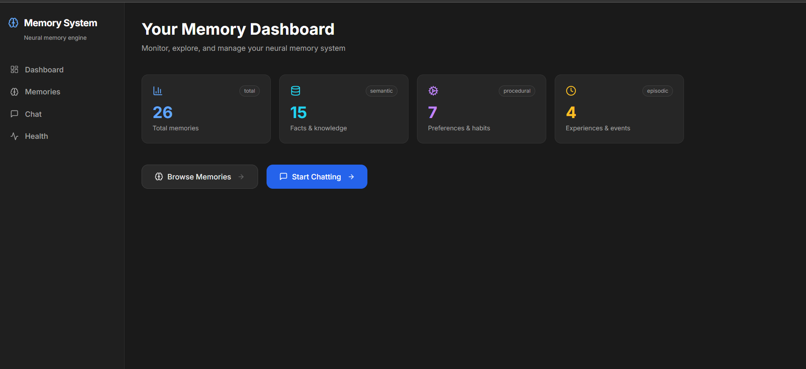
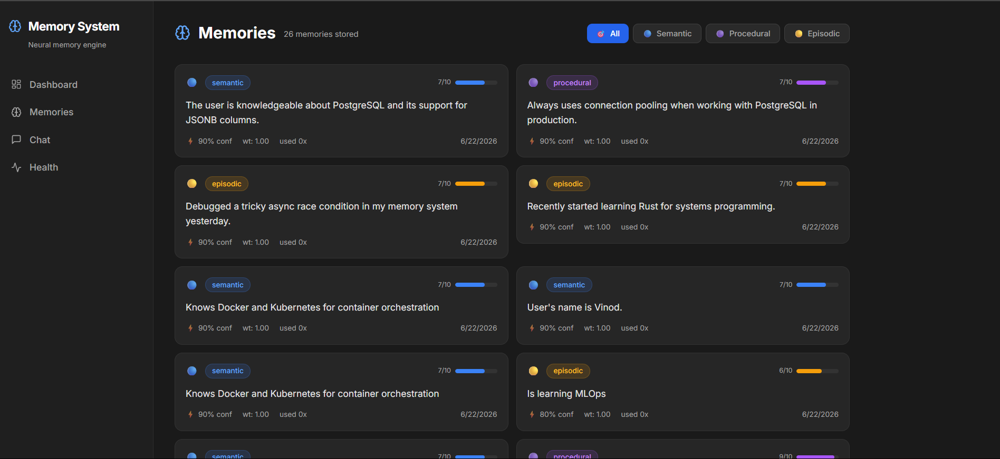
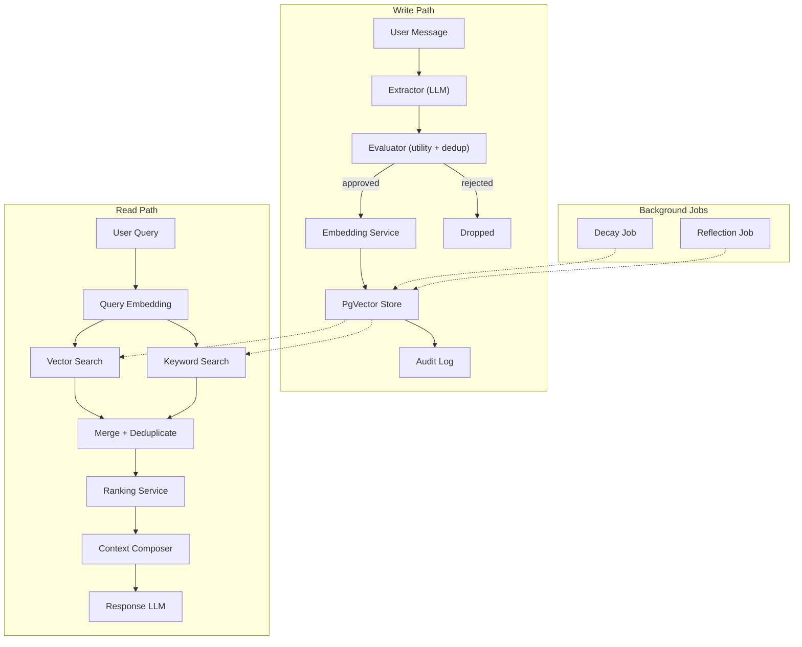

# Chat Memory System

A persistent memory layer for conversational AI that learns, remembers, and retrieves user context across sessions.

This system implements the memory architecture similiar like ChatGPT Memory. It classifies information into three cognitive types (semantic facts, procedural preferences, episodic experiences), evaluates what is worth storing, and retrieves relevant memories using hybrid search to personalize future responses. Deployed on Google Cloud, open source, and fully configurable.

[](LICENSE)
[](https://python.org)
[](https://fastapi.tiangolo.com)
[](https://postgresql.org)
[](https://github.com/pgvector/pgvector)
[](https://nextjs.org)

> **Try it live**: [chat-memory-frontend-248605995039.us-central1.run.app](https://chat-memory-frontend-248605995039.us-central1.run.app)

## Screenshots

| Dashboard | Memory Browser |
|-----------|---------------|
|  |  |

## Why This Exists

Every conversation with an LLM starts from a blank slate. The model does not know your name, your preferences, what you discussed yesterday, or what tools you use. Users compensate by repeating themselves in every session.

Memory changes that. This system sits between the user and the LLM, maintaining a persistent layer of knowledge about each user. It captures three types of memory:

| Type | What it stores | Example |
|------|---------------|---------|
| **Semantic** | Facts and knowledge | "Uses PostgreSQL for databases" |
| **Procedural** | Preferences, habits, how-tos | "Prefers concise explanations" |
| **Episodic** | Experiences and events | "Debugged a race condition yesterday" |

Not everything gets stored. A write gate evaluates each candidate memory for utility and deduplication before it enters the system. Memories that are no longer useful decay over time. A reflection agent periodically consolidates old memories into cleaner summaries.

The result: conversations that feel like they have continuity.

## Key Features

- **Selective extraction**: An LLM reads each message and identifies facts, preferences, and experiences worth remembering
- **Write gate**: Every candidate memory is scored for utility and checked for duplication before storage
- **Three memory types**: Semantic (facts), procedural (preferences), episodic (experiences), each stored and retrieved differently
- **Hybrid retrieval**: Vector similarity search and keyword search run in parallel, results are merged and deduplicated
- **Configurable ranking**: Multi-factor scoring based on semantic similarity, recency, access frequency, and importance. All weights are tunable
- **Memory decay**: Unused memories gradually lose weight. Memories below a configurable threshold are archived automatically
- **Reflection agent**: Consolidates clusters of old memories into summaries while preserving the originals for provenance
- **User isolation**: Row-level security on PostgreSQL ensures one user never sees another user's memories
- **Soft delete with audit trail**: Deleted memories are flagged, never physically removed. Every operation is logged
- **PII detection**: Filters credit cards, SSNs, API keys before storage
- **LLM provider fallback**: If the primary LLM provider hits quota limits, the system automatically switches to a fallback provider
- **Per-task model routing**: Different LLM models handle extraction, evaluation, embedding, and response generation. All configurable via environment variables

## Architecture



### Write Path

1. **Extract** - The LLM reads the user message and produces candidate memories as structured JSON, each typed as semantic, procedural, or episodic
2. **Evaluate** - Each candidate is scored for utility and checked against existing memories for duplication. Candidates that fail are dropped
3. **Embed** - Approved memories are converted to vector embeddings
4. **Store** - Memories are persisted to PostgreSQL with their embeddings, importance scores, and source metadata
5. **Audit** - Every write operation is logged to an append-only audit table with the originating conversation ID

### Read Path

1. **Retrieve** - The query is embedded and searched against stored memories via cosine similarity. A keyword search runs in parallel. If either search fails, the other continues (graceful degradation)
2. **Rank** - Results from both searches are merged, deduplicated by memory ID, and scored using configurable weights across semantic similarity, time since creation, access frequency, and stored importance
3. **Compose** - Top-ranked memories are grouped by type and formatted into a context block within a configurable token budget
4. **Respond** - The LLM generates a response with the composed memory context in its system prompt

### Background Jobs

- **Decay Job** - On a configurable schedule, multiplies all memory weights by a decay factor. Memories that fall below a threshold are archived
- **Reflection Job** - Selects the oldest N memories for a user, passes them to a reflection agent that produces consolidated summaries, archives the originals while preserving provenance links

## Design Principles

The system enforces four invariants at all times:

| # | Invariant | Enforcement |
|---|-----------|-------------|
| 1 | User A's memories are never returned to User B | Row-level security + `user_id` filter on every query |
| 2 | Deleted memories are never retrieved | `deleted = false` filter on every retrieval query |
| 3 | Retrieval failure never blocks a response | Try-catch with fallback to memoryless response |
| 4 | Every memory carries provenance | `source` JSONB field + append-only audit log |

## How It Compares

| | Store Everything + Vector Search | This System |
|---|---|---|
| **Write gate** | None. Everything is stored | LLM evaluates utility before storing |
| **Deduplication** | None. Duplicates accumulate | Evaluator checks against existing memories |
| **Memory types** | Untyped blobs | Semantic, procedural, episodic classification |
| **Retrieval** | Vector similarity only | Hybrid: vector + keyword, merged and ranked |
| **Ranking** | Raw similarity score | Multi-factor weighted score (configurable) |
| **Lifecycle** | Memories persist forever | Decay reduces weight. Reflection consolidates |
| **Provenance** | No tracking | Source metadata + audit log on every operation |

## Tech Stack

| Layer | Technology |
|-------|-----------|
| API Framework | FastAPI (async, dependency injection) |
| Database | PostgreSQL 15 + pgvector extension |
| ORM | SQLAlchemy 2.0 (async) + asyncpg |
| Cache | Redis (optional, graceful degradation) |
| LLM Providers | OpenAI, Anthropic, OpenRouter (fallback) |
| Embeddings | text-embedding-3-small (1536 dimensions) |
| Frontend | Next.js 14 + Tailwind CSS + Lucide |
| Containerization | Docker + Docker Compose |
| Cloud Deployment | Google Cloud Run + Cloud SQL |

## Repository Structure

```
backend/
  core/           # Abstract interfaces: MemoryEngine, WorkflowEngine, StorageBackend, LLMClient
  models/         # Pydantic schemas and enums (MemoryRecord, ConversationRequest/Response)
  config/         # Application settings via pydantic-settings (all env-driven)
  database/       # SQLAlchemy ORM models, async connection pool, repository layer
  capture/        # Write gate: Extractor (LLM) + Evaluator (LLM)
  store/          # PgVectorStore (implements StorageBackend), WriteService
  retrieve/       # HybridRetriever (vector + keyword), RankingService, GraphRetriever
  context/        # ContextComposer (token-budgeted memory formatting)
  orchestrator/   # SequentialWorkflowEngine, state management, node functions
  memory/         # MemoryService (high-level write + read path orchestration)
  agents/         # ReflectionAgent, BaseAgent, typed contracts
  tools/          # ConcreteLLMClient, ModelRouter, EmbeddingService, PIIFilter
  jobs/           # DecayJob, ReflectionJob (background)
  evaluation/     # GoldenDataset, RetrievalMetrics, MemoryJudge, RegressionGate
  api/            # REST routers: /health, /api/v1/memories, /api/v1/conversations
  auth/           # User ID extraction (header-based, JWT planned)
  prompts/        # Versioned prompt templates (extraction, evaluation, response)
  main.py         # FastAPI entry point with lifespan management

frontend/
  src/app/        # Next.js 14 pages (dashboard, memories, conversations, health)
  src/components/ # React components (ChatInterface, MemoryCard, MemoryEditor)
  src/lib/        # API client and TypeScript types

tests/            # 9-phase test suite covering foundation through concurrent workflows
fixtures/         # Golden retrieval dataset
scripts/          # Database migrations
docs/             # ADRs, future work documentation, screenshots
```

## Engineering Decisions

### ADR-001: PostgreSQL + pgvector over dedicated vector databases

A single PostgreSQL instance handles both structured queries (user isolation, type filtering, full-text search) and vector search (cosine similarity on embeddings). This eliminates the operational overhead of a second data store. Row-level security enforces user isolation at the database level. The `StorageBackend` abstract interface allows swapping to Pinecone or Weaviate if vector query volume exceeds single-node capacity.

### ADR-002: Modular monolith architecture

15 modules with inward-only dependencies. No circular imports. Each module has a clear responsibility and communicates through typed interfaces. This avoids microservice overhead while maintaining clean boundaries that can be split later.

### ADR-003: Sequential workflow engine (LangGraph deferred)

The write and read paths are linear pipelines. A sequential async engine is functionally equivalent to a graph engine for linear flows and avoids the LangGraph dependency in tests. The `WorkflowEngine` abstract interface allows swapping to LangGraph or Temporal when the pipeline becomes non-linear.

### ADR-004: Model routing by task type

Different tasks have different cost/quality tradeoffs. Extraction and evaluation use smaller, cheaper models. Response generation uses larger models. Embedding uses a dedicated embedding model. All model assignments are overridable via environment variables, so operators can tune the cost/quality balance for their deployment.

## Evaluation and Quality

### Test Suite

9 test phases covering progressive validation:

| Phase | Focus |
|-------|-------|
| 1 | Foundation: imports, dependency direction, abstract interfaces, models |
| 2 | Frontend contract: memory CRUD shapes, health endpoint format |
| 3 | Backend CRUD: user isolation, deleted exclusion, audit logging |
| 4 | Orchestration: write + read paths, extraction, evaluation, store |
| 5 | Retrieval quality: hybrid retrieval, ranking, deduplication |
| 6 | Advanced: decay job, reflection agent, PII filter, conversation endpoint |
| 7 | Golden dataset: regression gate with baseline precision/recall/latency |
| 8 | Graph retrieval: 1-hop memory edges, related memories |
| 9 | Concurrent workflows: multi-user isolation, state management, error recovery |

### Retrieval Metrics

Precision, recall, F1, and mean reciprocal rank (MRR) computed against a golden retrieval dataset. An LLM-as-judge evaluates extraction correctness, including hallucination detection and missed facts. A regression gate prevents quality degradation across deployments.

## Quick Start

### With Docker (local development)

```bash
git clone https://github.com/vinodwaghmare/chat-memory-system.git
cd chat-memory-system
cp .env.example .env
# Add your OPENAI_API_KEY to .env

docker compose -f docker-compose.dev.yml up --build
```

API at `http://localhost:8001/docs`.

### Without Docker

```bash
pip install -e ".[dev]"
uvicorn backend.main:app --reload --port 8001
```

Requires PostgreSQL with pgvector and Redis running separately.

### Frontend

```bash
cd frontend && npm install && npm run dev
```

### Try the API

```bash
# Store memories from a message
curl -X POST http://localhost:8001/api/v1/conversations/message \
  -H "Content-Type: application/json" \
  -H "X-User-ID: 550e8400-e29b-41d4-a716-446655440000" \
  -d '{"message": "I prefer Python and I build AI systems."}'

# List what was remembered
curl http://localhost:8001/api/v1/memories \
  -H "X-User-ID: 550e8400-e29b-41d4-a716-446655440000"
```

## Roadmap

### Implemented

- [x] Memory extraction, evaluation, and storage pipeline
- [x] Three memory types: semantic, procedural, episodic
- [x] Hybrid retrieval with configurable multi-factor ranking
- [x] Memory decay and reflection-based consolidation
- [x] PII detection and filtering
- [x] LLM provider fallback (OpenAI to OpenRouter)
- [x] Per-task model routing with env var overrides
- [x] User isolation with row-level security
- [x] Audit logging with provenance tracking
- [x] 9-phase test suite with golden dataset regression gate
- [x] Next.js dashboard with memory browser and chat interface
- [x] Production deployment on Google Cloud (Cloud Run + Cloud SQL)

### Planned

- [ ] Observability: Prometheus metrics, OpenTelemetry traces
- [ ] Security: JWT authentication, encryption at rest, Presidio PII
- [ ] Reliability: Circuit breakers, idempotency keys
- [ ] CI/CD: GitHub Actions pipeline with deployment gates
- [ ] HITL: Human-in-the-loop memory correction workflows

Half-built hooks for planned features are documented in [docs/FUTURE_WORK.md](docs/FUTURE_WORK.md).

## Contributing

See [CONTRIBUTING.md](CONTRIBUTING.md) for development setup, coding standards, and pull request guidelines.

## Security

See [SECURITY.md](SECURITY.md) for reporting vulnerabilities.

## License

This project is licensed under the MIT License. See [LICENSE](LICENSE) for details.
